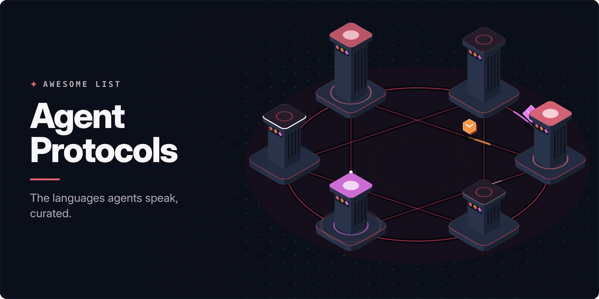

<!-- awesome:hero --><!-- /awesome:hero -->

<!-- awesome:title --><h1 align="center">Awesome Agent Protocols</h1><!-- /awesome:title -->

<!-- awesome:tagline -->The open protocols and conventions agents speak: tool access, agent-to-agent messaging, agent UIs, payments and instruction files.<!-- /awesome:tagline -->

<!-- awesome:badges -->

  
  
  

<!-- /awesome:badges -->

Agent protocols are the shared wire formats and file conventions that let AI agents reach tools, talk to each other, drive a user interface and pay. This list covers the specs themselves, their official SDKs and the tools built to implement or check them, grouped by what each protocol is for.

## Contents

- [Tools and context](#tools-and-context)
  - [Model Context Protocol](#model-context-protocol)
  - [Web page tools](#web-page-tools)
  - [Other tool protocols](#other-tool-protocols)
- [Agent to agent](#agent-to-agent)
  - [Agent2Agent](#agent2agent)
  - [Other agent-to-agent protocols](#other-agent-to-agent-protocols)
- [Agent interfaces](#agent-interfaces)
  - [Agent to UI](#agent-to-ui)
  - [Agent Client Protocol](#agent-client-protocol)
- [Payments and commerce](#payments-and-commerce)
- [Instruction files and skills](#instruction-files-and-skills)
  - [Instruction files](#instruction-files)
  - [Agent Skills and plugins](#agent-skills-and-plugins)
  - [llms.txt](#llmstxt)
- [Discovery, identity and naming](#discovery-identity-and-naming)
- [Agent runtimes and definitions](#agent-runtimes-and-definitions)
- [Foundations and reading](#foundations-and-reading)
- [Related lists](#related-lists)
- [Contributing](#contributing)

## Tools and context

### Model Context Protocol

- [MCP C# SDK](https://github.com/modelcontextprotocol/csharp-sdk) - Official C# SDK for MCP servers and clients, maintained with Microsoft.
- [MCP Conformance](https://github.com/modelcontextprotocol/conformance) - Official test suite that checks MCP clients and servers against the spec.
- [MCP Go SDK](https://github.com/modelcontextprotocol/go-sdk) - Official Go SDK for MCP servers and clients, maintained with Google.
- [MCP Inspector](https://github.com/modelcontextprotocol/inspector) - Official visual tool for testing and debugging MCP servers.
- [MCP Java SDK](https://github.com/modelcontextprotocol/java-sdk) - Official Java SDK for MCP servers and clients, maintained with Spring AI.
- [MCP Kotlin SDK](https://github.com/modelcontextprotocol/kotlin-sdk) - Official Kotlin SDK for MCP servers and clients, maintained with JetBrains.
- [MCP PHP SDK](https://github.com/modelcontextprotocol/php-sdk) - Official PHP SDK for MCP servers and clients, maintained with The PHP Foundation.
- [MCP Python SDK](https://github.com/modelcontextprotocol/python-sdk) - Official Python SDK for MCP servers and clients.
- [MCP Registry](https://github.com/modelcontextprotocol/registry) - Official registry service and server.json format for publishing MCP servers.
- [MCP Ruby SDK](https://github.com/modelcontextprotocol/ruby-sdk) - Official Ruby SDK for MCP servers and clients.
- [MCP Rust SDK](https://github.com/modelcontextprotocol/rust-sdk) - Official Rust SDK for MCP servers and clients.
- [MCP Skills Extension](https://github.com/modelcontextprotocol/ext-skills) - Official MCP extension for finding and loading Agent Skills through MCP.
- [MCP Swift SDK](https://github.com/modelcontextprotocol/swift-sdk) - Official Swift SDK for MCP servers and clients.
- [MCP Tasks Extension](https://github.com/modelcontextprotocol/ext-tasks) - Reference for the MCP tasks extension, which runs tool calls as long-lived tasks.
- [MCP TypeScript SDK](https://github.com/modelcontextprotocol/typescript-sdk) - Official TypeScript SDK for MCP servers and clients.
- [MCPB](https://github.com/modelcontextprotocol/mcpb) - Bundle format and CLI for one-click installs of local MCP servers in desktop apps.
- [Model Context Protocol](https://modelcontextprotocol.io/specification/latest) - Open spec for connecting agents to tools, data and prompts over JSON-RPC.

### Web page tools

- [MCP-B](https://github.com/WebMCP-org/npm-packages) - npm packages with transports, React hooks and browser tools for WebMCP and MCP.
- [Model Context Tool Inspector](https://github.com/beaufortfrancois/model-context-tool-inspector) - Chrome extension that lists, watches and runs the WebMCP tools a page registers.
- [NLWeb](https://github.com/nlweb-ai/NLWeb) - Protocols and reference code that give a website a natural language API over MCP.
- [WebMCP](https://github.com/webmachinelearning/webmcp) - W3C community proposal for a browser API that lets web pages expose tools to agents.
- [WebMCP Tools](https://github.com/GoogleChromeLabs/webmcp-tools) - Chrome team utilities and demos for building and testing WebMCP tools.

### Other tool protocols

- [Code Mode](https://github.com/universal-tool-calling-protocol/code-mode) - Library that lets agents call MCP and UTCP tools by writing and running code.
- [UTCP](https://github.com/universal-tool-calling-protocol/utcp-specification) - Universal Tool Calling Protocol spec, where agents call tools over their native APIs.
- [UTCP Python](https://github.com/universal-tool-calling-protocol/python-utcp) - Official Python implementation of UTCP for clients and tool providers.
- [UTCP TypeScript](https://github.com/universal-tool-calling-protocol/typescript-utcp) - Official TypeScript implementation of UTCP for clients and tool providers.

## Agent to agent

### Agent2Agent

- [A2A .NET SDK](https://github.com/a2aproject/a2a-dotnet) - Official C# and .NET SDK for A2A agents and clients.
- [A2A CLI](https://github.com/a2aproject/a2a-cli) - Official command line client for talking to A2A agents.
- [A2A Go SDK](https://github.com/a2aproject/a2a-go) - Official Go SDK for A2A agents and clients.
- [A2A Inspector](https://github.com/a2aproject/a2a-inspector) - Official web tool that validates Agent Cards and A2A message flows.
- [A2A Java SDK](https://github.com/a2aproject/a2a-java) - Official Java SDK for A2A agents and clients.
- [A2A JavaScript SDK](https://github.com/a2aproject/a2a-js) - Official JavaScript and TypeScript SDK for A2A agents and clients.
- [A2A Python SDK](https://github.com/a2aproject/a2a-python) - Official Python SDK for A2A agents and clients.
- [A2A Rust SDK](https://github.com/a2aproject/a2a-rs) - Official Rust SDK for A2A agents and clients.
- [A2A Samples](https://github.com/a2aproject/a2a-samples) - Official sample agents and clients across frameworks and languages.
- [A2A TCK](https://github.com/a2aproject/a2a-tck) - Compatibility suite that tests an A2A implementation over gRPC, JSON-RPC and HTTP.
- [Agent2Agent Protocol](https://a2a-protocol.org/latest/specification/) - Linux Foundation spec for agents handing tasks to each other, with Agent Cards for discovery.

### Other agent-to-agent protocols

- [Agent Network Protocol](https://github.com/agent-network-protocol/AgentNetworkProtocol) - Decentralized agent protocol with did:wba identity and meta-protocol negotiation.
- [AgentConnect](https://github.com/agent-network-protocol/anp) - Multi-language SDK and reference implementation of the Agent Network Protocol.
- [Eclipse LMOS Protocol](https://eclipse.dev/lmos/docs/lmos_protocol/introduction/) - Eclipse spec for agent and tool discovery and messaging built on W3C Web of Things.
- [NLIP](https://ecma-international.org/publications-and-standards/standards/ecma-430/) - Natural Language Interaction Protocol, the Ecma standard ECMA-430 for agent messages.
- [SLIM](https://github.com/agntcy/slim) - AGNTCY secure messaging layer that carries A2A and MCP traffic between agents.
- [SLIM Specification](https://github.com/agntcy/slim-spec) - Protocol spec for SLIM messaging between agents.

## Agent interfaces

### Agent to UI

- [A2UI](https://github.com/a2ui-project/a2ui) - Format and renderers that let agents send updatable UIs clients draw natively.
- [AG-UI](https://github.com/ag-ui-protocol/ag-ui) - Event protocol and SDKs that stream agent messages, state and tool calls to front ends.
- [AGenUI](https://github.com/AGenUI/AGenUI) - Native A2UI renderer for iOS, Android and HarmonyOS apps.
- [AI SDK UI Stream Protocol](https://ai-sdk.dev/docs/ai-sdk-ui/stream-protocol) - Vercel AI SDK spec for streaming text, reasoning and tool parts to chat UIs.
- [CopilotKit](https://github.com/CopilotKit/CopilotKit) - Front-end framework from the makers of AG-UI for building agent UIs on it.
- [MCP Apps](https://github.com/modelcontextprotocol/ext-apps) - Official MCP extension and SDK for interactive UIs that servers render in chat clients.
- [MCP-UI](https://github.com/MCP-UI-Org/mcp-ui) - SDKs for sending interactive UI resources over MCP.
- [OpenAI Apps SDK](https://developers.openai.com/apps-sdk) - OpenAI framework for ChatGPT apps, built on MCP with embedded UI widgets.

### Agent Client Protocol

- [ACP Go SDK](https://github.com/coder/acp-go-sdk) - Go SDK for ACP clients and agents, maintained by Coder.
- [ACP Java SDK](https://github.com/agentclientprotocol/java-sdk) - Official Java SDK for ACP clients and agents.
- [ACP Kotlin SDK](https://github.com/agentclientprotocol/kotlin-sdk) - Official Kotlin SDK for ACP clients and agents.
- [ACP Python SDK](https://github.com/agentclientprotocol/python-sdk) - Official Python SDK for ACP clients and agents.
- [ACP Registry](https://github.com/agentclientprotocol/registry) - Registry of agents that implement ACP, read by clients to list them.
- [ACP Rust SDK](https://github.com/agentclientprotocol/rust-sdk) - Official Rust SDK for ACP clients and agents.
- [ACP TypeScript SDK](https://github.com/agentclientprotocol/typescript-sdk) - Official TypeScript SDK for ACP clients and agents.
- [ACP UI](https://github.com/formulahendry/acp-ui) - Desktop, mobile and web client for any ACP agent.
- [acp.el](https://github.com/xenodium/acp.el) - Emacs Lisp implementation of ACP for building Emacs clients.
- [acpx](https://github.com/openclaw/acpx) - Headless command line client for stateful ACP sessions.
- [Agent Client Protocol](https://agentclientprotocol.com) - JSON-RPC protocol, started by Zed, that connects any code editor to any coding agent.
- [Claude Agent ACP](https://github.com/agentclientprotocol/claude-agent-acp) - Adapter that runs the Claude Agent SDK behind any ACP client.
- [Codex ACP](https://github.com/agentclientprotocol/codex-acp) - ACP server that exposes the Codex CLI to ACP clients and editors.
- [Obsidian Agent Client](https://github.com/RAIT-09/obsidian-agent-client) - Obsidian plugin that runs ACP agents such as Claude Code and Codex.
- [VS Code ACP](https://github.com/formulahendry/vscode-acp) - VS Code extension that connects the editor to any ACP coding agent.

## Payments and commerce

- [A2A x402 Extension](https://github.com/google-agentic-commerce/a2a-x402) - A2A extension that adds x402 crypto payments to agent-to-agent tasks.
- [Agent Payments Protocol](https://github.com/google-agentic-commerce/AP2) - AP2 spec and samples for signed mandates that authorize agent purchases.
- [Agentic Commerce Protocol](https://github.com/agentic-commerce-protocol/agentic-commerce-protocol) - OpenAI and Stripe spec for checkout between buyer agents and merchants.
- [Aperture](https://github.com/lightninglabs/aperture) - Reverse proxy that charges for API calls with L402 Lightning payments.
- [L402](https://github.com/lightninglabs/L402) - Spec for paying for APIs over HTTP 402 with Lightning, using the receipt as auth.
- [Machine Payments Protocol](https://github.com/tempoxyz/mpp-specs) - Specs for MPP, an HTTP Payment auth scheme for machine-to-machine payments.
- [pay](https://github.com/solana-foundation/pay) - Solana Foundation CLI for agent payments over x402, MPP and AP2.
- [Trusted Agent Protocol](https://github.com/visa/trusted-agent-protocol) - Visa spec and samples that let merchants verify an agent and the shopper behind it.
- [Trusted Agentic Commerce Protocol](https://github.com/forter/trusted-agentic-commerce-protocol) - Forter protocol and SDKs for agents and merchants to authenticate and share data.
- [UCP CLI](https://github.com/Shopify/ucp-cli) - Shopify CLI and agent skill that searches, carts and checks out at UCP merchants.
- [UCP JavaScript SDK](https://github.com/Universal-Commerce-Protocol/js-sdk) - Official JavaScript SDK for the Universal Commerce Protocol.
- [UCP Python SDK](https://github.com/Universal-Commerce-Protocol/python-sdk) - Official Python SDK for the Universal Commerce Protocol.
- [Universal Commerce Protocol](https://github.com/Universal-Commerce-Protocol/ucp) - UCP spec covering agent product discovery, carts and checkout with merchants.
- [x402](https://github.com/x402-foundation/x402) - HTTP 402 payment protocol and SDKs for paying per request, from the x402 Foundation.
- [x402-rs](https://github.com/x402-rs/x402-rs) - Rust crates and facilitator for verifying and settling x402 payments.
- [x402scan](https://github.com/Merit-Systems/x402scan) - Explorer for x402 resources, sellers and transactions.

## Instruction files and skills

### Instruction files

- [AGENTS.md](https://agents.md) - Markdown file at a repo root that tells coding agents how to build, test and work.
- [agnix](https://github.com/agent-sh/agnix) - Linter and language server for AGENTS.md, CLAUDE.md, SKILL.md, hooks and MCP configs.
- [DESIGN.md](https://github.com/google-labs-code/design.md) - Google Labs format for describing a product's visual identity to coding agents.
- [Ruler](https://github.com/intellectronica/ruler) - CLI that writes one set of rules into each coding agent's instruction file.

### Agent Skills and plugins

- [Agent Plugins](https://github.com/agentplugins/agent-plugins-spec) - Spec for packaging skills, MCP servers and other agent extensions as one plugin.
- [Agent Skills](https://agentskills.io/specification) - Open format for agent skills: a folder with a SKILL.md, scripts and resources.
- [Anthropic Skills](https://github.com/anthropics/skills) - Anthropic's public repository of example and reference Agent Skills.
- [OpenSkills](https://github.com/numman-ali/openskills) - CLI that installs and loads SKILL.md skills for any coding agent.
- [skill-validator](https://github.com/agent-ecosystem/skill-validator) - CLI that checks a skill against the Agent Skills spec and scores its content.
- [skills](https://github.com/vercel-labs/skills) - Vercel CLI, run as npx skills, that installs Agent Skills into coding agents.

### llms.txt

- [docusaurus-plugin-llms](https://github.com/rachfop/docusaurus-plugin-llms) - Docusaurus plugin that generates llms.txt files from a docs site.
- [llms.txt](https://llmstxt.org) - Proposal for a Markdown file at a site root that points LLMs to its key content.
- [llms.txt hub](https://github.com/thedaviddias/llms-txt-hub) - Directory of sites and tools that publish or build llms.txt files.
- [nuxt-llms](https://github.com/nuxt-content/nuxt-llms) - Nuxt module that generates llms.txt from a Nuxt app.
- [vitepress-plugin-llms](https://github.com/okineadev/vitepress-plugin-llms) - VitePress plugin that generates llms.txt and LLM-friendly pages for a docs site.

## Discovery, identity and naming

- [Agent Directory](https://github.com/agntcy/dir) - AGNTCY service that announces and finds agents by their OASF records.
- [Agent Identity and Discovery](https://aid.agentcommunity.org) - Spec that publishes an agent's endpoint and protocol in a DNS TXT record.
- [Agent Name Service](https://genai.owasp.org/resource/agent-name-service-ans-for-secure-al-agent-discovery-v1-0/) - OWASP GenAI paper on DNS-style names and PKI identity for finding agents.
- [AGNTCY Identity](https://github.com/agntcy/identity) - Issues and verifies identities for agents, MCP servers and multi-agent systems.
- [AI Catalog](https://github.com/Agent-Card/ai-catalog) - Draft shared catalog format, from MCP and A2A members, for finding AI artifacts.
- [ANS](https://github.com/agentnameservice/ans) - Registry and transparency log implementing the IETF Agent Name Service draft.
- [Cloudflare Web Bot Auth](https://github.com/cloudflare/web-bot-auth) - Cloudflare libraries that sign and verify agent HTTP requests per Web Bot Auth.
- [DNS-AID](https://datatracker.ietf.org/doc/draft-mozleywilliams-dnsop-dnsaid/) - IETF draft for publishing and finding agents through DNS records.
- [ERC-8004](https://eips.ethereum.org/EIPS/eip-8004) - Ethereum standard with on-chain registries for agent identity, reputation and validation.
- [LAD-A2A](https://github.com/franzvill/lad) - Protocol for finding A2A agents on a local network, with signed Agent Cards and consent.
- [NANDA](https://projectnanda.org) - MIT-started project building an agent index, naming and verifiable agent facts.
- [OASF](https://github.com/agntcy/oasf) - Open Agentic Schema Framework, a schema for describing agent skills and capabilities.
- [Web Bot Auth](https://datatracker.ietf.org/wg/webbotauth/about/) - IETF working group on signed HTTP requests that let sites verify bots and agents.

## Agent runtimes and definitions

- [Agent Host Protocol](https://github.com/microsoft/agent-host-protocol) - Microsoft protocol that keeps agent sessions in sync across many connected clients.
- [Agent Protocol](https://github.com/langchain-ai/agent-protocol) - LangChain API spec for serving agents through runs, threads and a store.
- [Open Agent Specification](https://github.com/oracle/agent-spec) - Oracle-started language for defining agents and flows that run on any framework.
- [Open Responses](https://www.openresponses.org) - Open spec, modeled on the OpenAI Responses API, for one LLM interface across providers.

## Foundations and reading

- [A Survey of Agent Interoperability Protocols](https://arxiv.org/abs/2505.02279) - Paper comparing MCP, ACP, A2A and ANP, with a phased adoption roadmap.
- [A Survey of AI Agent Protocols](https://arxiv.org/abs/2504.16736) - Paper that sorts agent protocols into context-oriented and inter-agent kinds.
- [A2A and MCP](https://a2a-protocol.org/latest/topics/a2a-and-mcp/) - A2A docs page on how A2A and MCP split work between agents and tools.
- [Agentic AI Foundation](https://aaif.io) - Linux Foundation home for MCP, AGENTS.md and other open agent projects.
- [Announcing the Agent2Agent Protocol](https://developers.googleblog.com/en/a2a-a-new-era-of-agent-interoperability/) - Google launch post that explains the design principles behind A2A.
- [Bring Your Own Agent to Zed](https://zed.dev/blog/bring-your-own-agent-to-zed) - Zed launch post that introduces the Agent Client Protocol.
- [Equipping Agents for the Real World with Agent Skills](https://www.anthropic.com/engineering/equipping-agents-for-the-real-world-with-agent-skills) - Anthropic engineering post on how skills load in stages.
- [Introducing the Model Context Protocol](https://www.anthropic.com/news/model-context-protocol) - Anthropic launch post for MCP.
- [MCP for Beginners](https://github.com/microsoft/mcp-for-beginners) - Microsoft course on MCP with examples in several languages.
- [W3C AI Agent Protocol Community Group](https://www.w3.org/community/agentprotocol/) - W3C group working on open protocols for agent discovery, identity and messaging.

## Related lists

- [Awesome A2A](https://github.com/ai-boost/awesome-a2a) - List of A2A agents, tools, servers and clients.
- [Awesome Agentic Commerce](https://github.com/xpaysh/awesome-agentic-commerce) - List of protocols and implementations for agent-to-merchant commerce.
- [Awesome Claude Skills](https://github.com/ComposioHQ/awesome-claude-skills) - List of Claude skills and tools for making them.
- [Awesome MCP Devtools](https://github.com/punkpeye/awesome-mcp-devtools) - List of SDKs, libraries and testing tools for MCP.
- [Awesome MCP Servers](https://github.com/punkpeye/awesome-mcp-servers) - Large categorized list of MCP servers.
- [Awesome WebMCP](https://github.com/webmachinelearning/awesome-webmcp) - List of WebMCP resources from the proposal's community group.
- [Awesome x402](https://github.com/xpaysh/awesome-x402) - List of x402 resources, SDKs and services.

## Contributing

Contributions are welcome. Read the [contribution guidelines](contributing.md) first.

<!-- awesome:maintainer -->
Maintained by [Ian Wiedenman](https://github.com/ianwieds).
<!-- /awesome:maintainer -->
